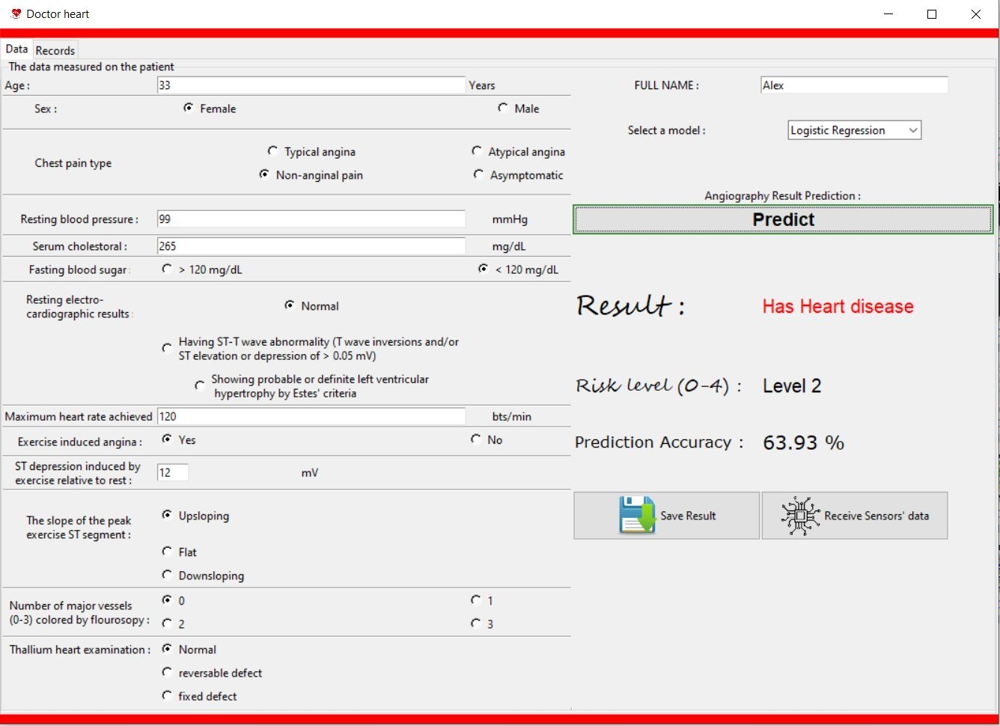

# heart-disease-diagnosis-ML-models
# Machine Learning models to predict heart disease

A python program which used data analysis techniques to observe trends between various risk factors for heart diseases. Then, machine leaning models were created to predict whether a person has heart disease based on those features.


## Required packages
1. Requires ```Python 3.7``` or above.
2. Requires these modules:
    - NumPy
    - pandas
    - matplotlib
    - tkinter
    - scikit-learn
    - joblib
## Running the program
1. Download the whole repository
2. extract the code
3. open ```heart_CAD.py``` and press enter to run the program

##### Note: I used Spyder IDE along with anaconda throughout this project (on Windows 10) 

## Models used:
1. [Logistic Regression](https://scikit-learn.org/stable/modules/generated/sklearn.linear_model.LogisticRegression.html)
2. [Decision Trees](https://scikit-learn.org/stable/modules/tree.html)
3. [K-nearest neighbors](https://scikit-learn.org/stable/modules/generated/sklearn.neighbors.KNeighborsClassifier.html)
## Desktop interface


## General information
 The Cleveland dataset (processed.cleveland.data) that can be downloaded from the UCI Machine Learning Repository via the following website:
    https://archive.ics.uci.edu/ml/datasets/Heart+Disease
    
 1. Attribute Information
      - (age) : Integer: [29-77]       
      -  #4  (sex)       
      -  #9  (cp)        
      - #10 (trestbps)  : Integer: [94-200]
      - #12 (chol)   : Integer: [126-564]   
      - #16 (fbs)       
      - #19 (restecg)   
      - #32 (thalach)   : Integer: [71-202]
      - #38 (exang)     
      - #40 (oldpeak)  : Float: [0.0-62.0] 
      - #41 (slope)     
      - #44 (ca)        
      - #51 (thal)
      - num: diagnosis of heart disease (angiographic disease status) : The target labels spanned from 0 to 4, with 0 indicating least chances of having a heart disease whereas label 4, indicating highest chances of having a heart disease
      
## Contributing

Pull requests are welcome for adding more ML models or fixing exisiting issues. 

